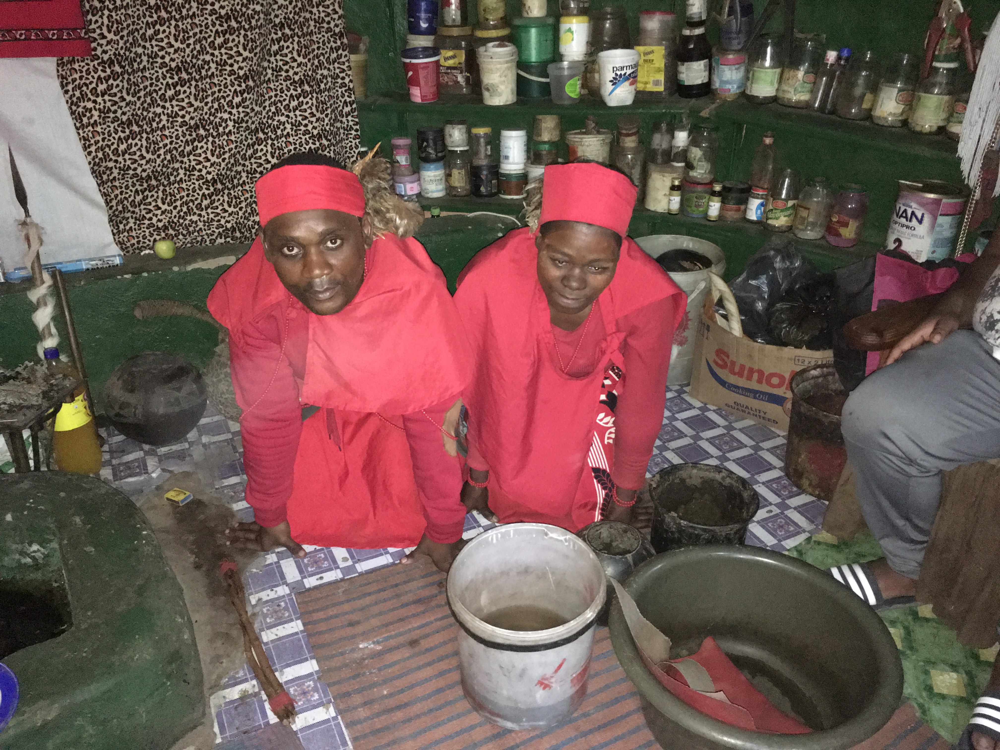

A nursing colleague recently came up to me mid-shift and asked for a sick note, even though there was nothing obviously wrong with him. He informed me that he needed to go back to his village for a family ceremony to inform their ancestors that his ‘Gogo’ (grandmother) was moving house. Not wanting to be culturally insensitive I swiftly signed the sick note and then asked if they had a cow to slaughter as is usually the custom. He told me that no, for this particular ceremony they were just slaughtering a goat. My fascination got the better of me and I attempted to extract the rationale for ‘goat vs. cow’ but, sick note now in hand, his answers were unrevealing and he was clearly keen to go on his way.

The vast majority of Xhosa people hold a fusion belief system where their ancient ancestry beliefs are combined with Christianity. Ancestors, like God, are capable of helping out in times of need: when terminally ill patients on the ward have not responded to the best medical care possible our South African doctors will earnestly state that the ancestors need to step-in. Simultaneously, everyone attends Church piously on Sundays and breaks out into gospel singing and dancing whenever given half a chance. When good things happen one or the other gets the credit but after months of attentive watching I am still unable to distinguish ancestry intervention from the divine. Similarly, ancestors and God can both get angry if they’re not paid sufficient respect and cause all sorts of trouble.
 

 
Even being as unsuperstitious as they come I've heard some tales which made me stop and think. One colleaguehad a considerable amount of time off work and was not making much of a recovery. During her period of illness, her father was visited by his great-grandfather in a dream and told that he must find his grave and take her to it in order for her to be cured. Graves of that generation are not marked with tombstones and are often remote and impossibly difficult to find. In the dream his ancestor showed him a large towering rock which he’d never seen before and said that the grave would be close by. He drove around the general area where his family had been for generations and after much driving spotted the rock from a distance. When he got closer and couldn't drive any further he got out of the car and walked until he reached the foot of the rock. There they found a very discrete grave marked with a small rock unmistakeably engraved with the name of his great-grandfather. He brought his daughter and whole family to the site of the grave, they slaughtered a cow and she was back at work within a few days.

For most local people, the hospital isn’t the first port of call when they become sick. Some patients will arrive with clusters of neat cuts etched into their skin and children often have multi-coloured twine tied around their waists. This is the work of the traditional healers, or ‘sangomas’, as they’re called locally. They're believed by many local people to possess great healing power through their intimate knowledge of herbal remedies and their ability to act as a medium between the ancestors and the living world. It is hard to miss them walking around town: they wear floor length skirts, a headscarf with chicken feathers tied to the back and a long curved stick in one hand with a cow-tail whisk in the other. All sangomas will have received a calling from their ancestors summoning them to embark on the rigorous training required. They're visited in dreams and experience constant bodily discomfort and anxiety until they are overwhelmed and have to succumb. The training is extremely expensive and the family of a trainee sangoma will make many sacrifices to pay for it.

Although many nurses and doctors working at St. Patrick’s believe in ancestry, most do not have faith in the power of sangomas and there’s a real ‘us or them’ mentality and when you see the amount of harm their treatments can cause you quickly start to feel the same. Patients taking regular herbal medication often come in with liver damage so severe they can be confused or psychotic. Many pregnant women present with pre-term labour because of taking a herbal medication called ‘embelegezana’. They drink it a few weeks before they’re due because they believe it will expel the foetus more safely than natural labour. Instead, it causes dangerously strong contractions which amplify the severity of any problem they have. Children who suffer with diarrhoea are sometimes given a herbal treatment called a ‘sunlight enema’ which in of itself has disastrous consequences but also causes delays in them obtaining life-saving intravenous rehydration at hospital. Many people also talk about their ‘black magic’ which involves the use of human material to cast evil spells. Albino parts come at a particular premium: recently a non-albino man killed his albino wife to sell her parts for money. Yet another reason why my front door is seldom unlocked.  

In spite of seeing and hearing about these terrible things I’ve harboured a fascination with sangomas since I arrived. Most patients will have consulted a sangoma before they see me: I imagine partly because they're more accessible (many patients will live over an hour from their nearest nurse-led clinic and much further from the hospital) but also because they must believe in their power. Working as a doctor, I only ever see the cases where the sangoma's treatment has been unsuccessful and I imagine they could do a lot of good that I never get to hear about. I’ve also been interested in how they view orthodox medicine given that I’ve seen sangomas bringing patients to OPD for HIV treatment. Since arriving, I’d been trying to find an opportunity to meet a sangoma and, a few weeks ago, I finally got my chance.

During a busy on-call Saturday shift a sangoma casually walked past clad head to toe in red with stick and whisk in hand. She started talking to a young patient who’d been bitten by a snake and I assumed she’d been asked to come to the rescue because she’d been told me and my tablets weren’t doing a great job. It turned out that, in fact, they were from the same sangoma school and she was just paying him a friendly visit. The sangoma asked me how her colleague was getting on and didn’t display a trace of the same ‘us or them’ mentality that we hold in hospital. After a while spent chatting she extended the invitation for a few of us to come and visit the school and learn about what they do. 

The school was a short drive out of town along dirt roads traversing beautiful countryside. A friendly sangoma-in-training met us on the main dirt road and jumped in the car to direct us the rest of the way. He spoke excellent English and told us he had travelled far from home in Richard’s Bay to be trained by the head sangoma at this particular school. He described the principal as a very powerful man who had received special training beneath the sea by spirits. My doctor companion, a fellow 'umlungu', pulled a face and started an inquisition: ‘What do you mean beneath the sea…for how long? A year? How did he breathe?’ 

On arriving we were met by the other trainee sangomas who welcomed and led us into a small rounded hut lit only by a burning central candle. Dozens of pots and jars full of herbal potions lined one wall from floor to ceiling but with the labels of their original product still intact: ‘Parmalait Yoghurt’, ‘Helmann’s Mayonnaise’, ‘Nescafe’, ‘Smirnoff’. All the trainee sangomas leant forward on the floor and looked up in wonderment when the principal entered: a man in his thirties who was surprisingly rotund for one heralded to possess such negative buoyancy. For a man of such power he was also very unassuming and awkwardly sidled over to the chair giggling as he went. 

He proceeded to clarify the myth about his training: he had actually been trained at the bottom of a river, not the sea. In fact, he had been trained where the Mtavuna river joins the Indian Ocean as this place possesses high spiritual value being where the River and Sea Princesses meet. Our attempts to get him to expand on this were unfortunately met with smiles and indirect answers. The only piece of information we managed to glean was that he had taken breaks from being underwater but could be submerged for days at a time. Our questions became more and more tangential as we attempted to find ways to prise open the door to his story. We finally gave up when my doctor colleague asked whether there had been any dangerous snakes in the river to which he replied that there had been but he was glad to see them as they are a sign of the ancestor's protection.

We changed the topic and starting asking the principal and his trainees more general questions about the school and life as a sangoma. Training takes between four months to one year and there are different grades of trainee sangoma marked by the different colour of their clothes: red is the lowest, white is the highest. They explained that the chicken feathers attached to their headband facilitate their communication with the ancestors much like the local phone networks, MTN and Vodacom, would connect us with friends. On asking to see some of the herbal potions, a glass bottle was passed around containing a yellowish liquid used to treat epilepsy. Apparently, they take a syringe of the liquid and shoot it up the nose and into the brain where it acts. 

On the wall of the hut we could see many certificates which had been given to the principal including one endorsement from the Eastern Cape Department of Health. Apparently, they have some oversight to prevent any tom, dick or harry masquerading as a sangoma without having received appropriate training. This seems to have been quite effective as the sangomas acknowledged that orthodox medicine was better in a few situations naming HIV and orthopaedics in particular. However, clearly, there’s still work to be done: near to the closing of our conversation they told us about their five psychiatric inpatients, some of whom had been admitted for weeks. Fortunately we weren’t offered the opportunity to go and see them.

After our questions petered out we moved from the first candle-lit hut into another where a smiling old woman sat in the corner. She turned out to be the principal’s mother: her son’s the first sangoma in the family and she’s very proud. The trainee sangomas proceeded to perform an ancestry ritual for us: in pairs they lit herbs at one end of the hut to create a small fire with a strong aroma and attached straps to their ankles with the tops of many aluminium cans attached. They held the soles of their feet over the fire before starting to dance rhythmically with the stamping of their feet, the jangling of the aluminium and the banging of the drum (played by the principal’s very pregnant sister) creating a mesmerizing sound and display. We were told that the performance creates the trance and exhaustion necessary for the sangomas to enter a state of mind where they can communicate with the ancestors. Each pair of sangomas continued to dance for a long time, looking increasingly sweaty but never missing a step before finally collapsing in front of the fire. They began to chant with the other trainee sangomas joining in chorus at particular points. 

Once the ceremony was over we received a warm farewell and the car journey home was spent sharing our conflicted feelings. From this one fleeting visit I hadn’t been convinced that their treatments benefited anyone but if I was able to spend more time with them maybe I would? Given the appreciation they had for orthodox medicine in some situations, I felt it would be achievable to foster a relationship and convince them that certain other conditions were best seen by us as well. This would have to be a very long-term project, though, and not one that a foreigner could pioneer: it would be difficult for an ‘umlungu’ to ever possess the cultural knowledge required to change their practice while still making them feel respected. Unfortunately, the black magic ‘superstitions’ held by our South African colleagues make them difficult to convert to the struggle so this project is likely to remain shelved for the foreseeable future. 

