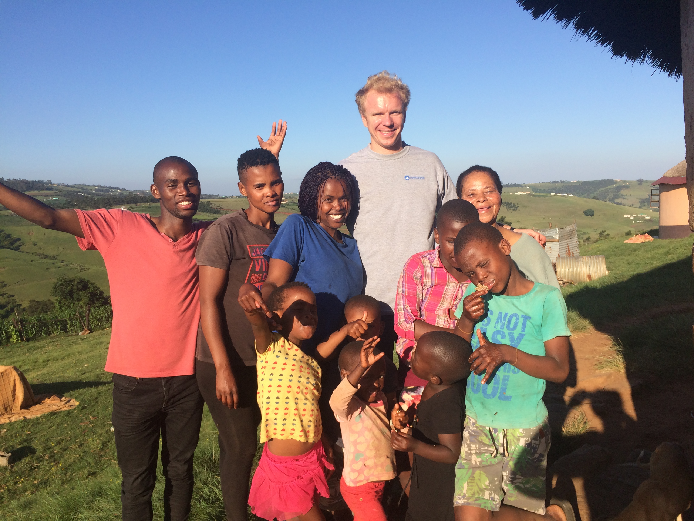

Over the last few weeks I’ve made a conscious effort to try and make local friends and get to know Bizana a bit better. The initial disappointment with its dusty frontier town appearance and the violence that happens (mostly) after dark has been whittled away by the warmth and friendliness of everyone I meet. A couple of weeks ago I walked down the road to grab some lunch and was stopped by a Nigerian guy called ‘Ola’ who’s kid I’d treated in casualty a few weeks before. He proceeded to take me to his favourite lunch spot and then showed me his store – a tiny box room down a back alley packed floor to ceiling with TVs and crammed with more family members than I would have believed was possible. When he told me he’d been on his way back from the mosque when we crossed paths he was shocked to learn I didn’t know it existed. He insisted on showing it to me even though I only had five minutes to get back to the hospital, pacing along the street three steps ahead of me, conversation now sacrificed towards this singular goal. On one street corner I was surprised to see him dart up a flight of stairs into a dilapidated building and followed him through a maze of corridors and up some more stairs, getting closer to the sound of running water until we turned a corner to find ablution blocks and a beautiful carpeted space with people praying. The second I’d set eyes on the place Ola beckoned to me and we left, making it back to the hospital in record time.

As far as I can make out, almost every man between the ages of seventeen and thirty-six belongs to a football team in Bizana. There are twenty teams divided between two leagues and they all train on the pitches close to the hospital. One team has been kind enough to adopt me and call me one of their own: ‘The Killer Stars’. What I’m really looking for is a casual kick-around but unfortunately no such thing exists here. ‘The Killer Stars’ train every single day between five and seven-thirty with matches every Sunday. So far I’ve only made it to two training sessions and haven’t been around for any games. The last session I attended was pure fitness for two and a half hours, the warrior like coach shouting at us intimidatingly in Xhosa every time the intensity dropped. At seven-thirty I was so relieved it was over I went to leave before realising it was time for the session de-brief. In true South African fashion we all stood around for thirty minutes while everyman and his dog said his piece on how the training session had gone and how things were lining up for the weekend’s game. During the debrief it was decided that ‘umlungu’ wasn’t an appropriate long-term nickname for me and I was renamed ‘Coutinho’ after one of the Barcelona players from Brazil. No parallels can be drawn between Coutinho and I either in the way that we look or in the way we play football. All I can assume is that, to my team-mates, 'white' people probably all look exactly the same and they chose a 'white' player completely at random. The differences between a Latin-American from Rio and an Anglo-Saxon from London being vanishingly subtle. The session was concluded with the coach looking intently into the eyes of everyone around the circle and proclaiming: ‘If we play on Sunday like we trained today we will KILL them. Because we are the KILLER STARS.’

As getting to grips with Xhosa is going to be essential to achieving any level of integration I’ve bought a language book and have been trying to study regularly. One of the nurses also introduced us to her brother, Aphiwe, who has been teaching us an evening each week. Of the eleven national languages, Xhosa’s the second most widely spoken after Zulu and is spoken throughout the Eastern Cape. People may or may not be being generous when they tell us it’s the most difficult of all of them. As well as being grammatically very difficult it’s infamous for the clicky noises ‘c’ ‘q’ and ‘x’ of which I have some grasp on ‘c’ and ‘x’ but no hope of ever mastering ‘q’. Listen to Miriam Makeba’s ‘click song’ below to understand why. On the positive side, there are fewer words to remember: the word _‘hlala’_, for example, can mean ‘to sit’, ‘to stay’ or ‘to live’. It also has some wonderful peculiarities, for instance, when you ask someone how they are they reply _‘hayi, sikhona’_ which literally means ‘no, we’re here’ but actually means ‘we’re fine because nothing bad’s happened and we’re still here’. After three months I can now stumble through a simple consultation asking basic questions and understanding very simple answers but, in spite of Aphiwe’s close instruction, I’m still a way off being conversational.

A couple of weekends ago Aphiwe invited me to visit his family in the rural areas where he had grown up. We turned off the tar road thirty minutes from Bizana and continued to drive along dirt tracks for another forty-five minutes with the settlements becoming more and more sparse as we drove further on. As we approached the village we stopped the car every few minutes to greet a cousin or old friend who he hadn’t seen in a while. A kilometre drom his village we passed his ex-girlfriends family rondavel which had such a beautiful backdrop that I unapologetically put him at risk by stopping the car to take a few photos. When we reached his family’s house we were greeted by a large number of excitable children and continued to spend most of the day with them. A whole day of playing wasn’t enough for their intrigue to wear off: little hands persisted to find their way through my hair and two bolder children even poked their heads under my T-shirt and shouted ‘mhloba!’ ‘so white!’. 

We spent a long time chatting with his grandmother who reminisced about the days when Bizana was an attractive trading post and the church and hospital were run by nuns. They talked about how, in the local schools, there’s a pressure for children to remain in the rural areas and many choose not to focus on their studies and pursue higher education. Furthermore, the children are not taught about contraception and many girls fall pregnant young and give up any hope of pursuing a career. Seeing the number of children around makes it clear that this is a huge problem and each generation the cycle repeats itself! Oddly there are power lines running all throughout the countryside which were erected by ESCOM, the state-owned power company, around election time many years ago. They promised imminent electricity but it still hasn’t arrived. People also have no running water or sewage system, use latrines for toilets and have to collect rainwater for drinking. They talked with hope about how things might change if the new face of the ANC, Cyril Ramaphosa, comes to power in 2019!  

