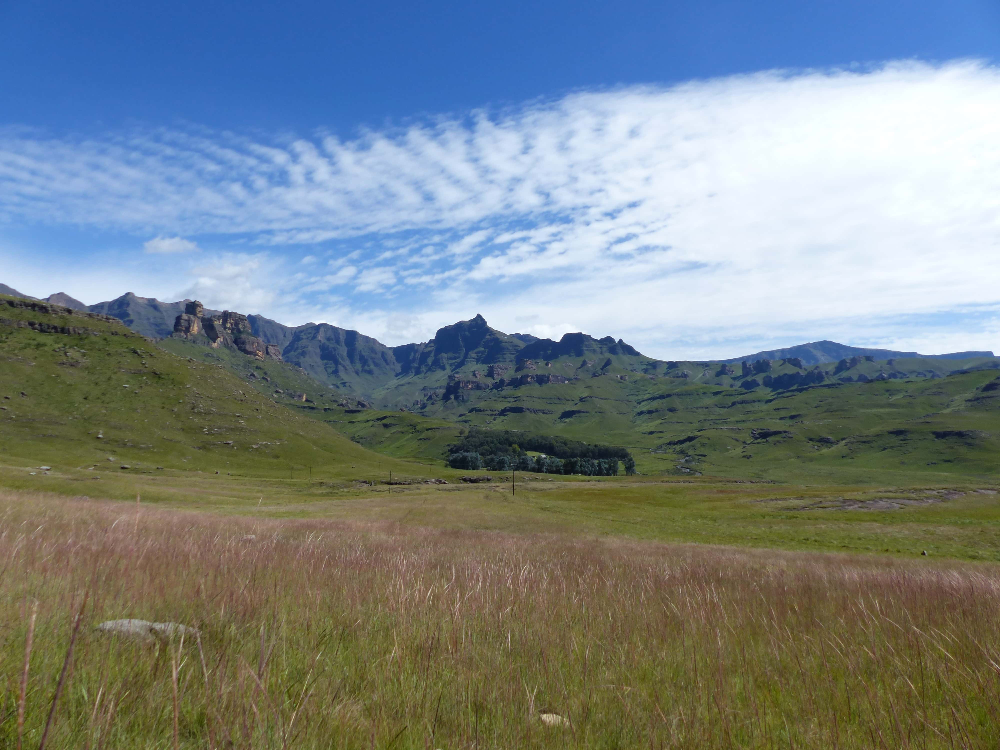
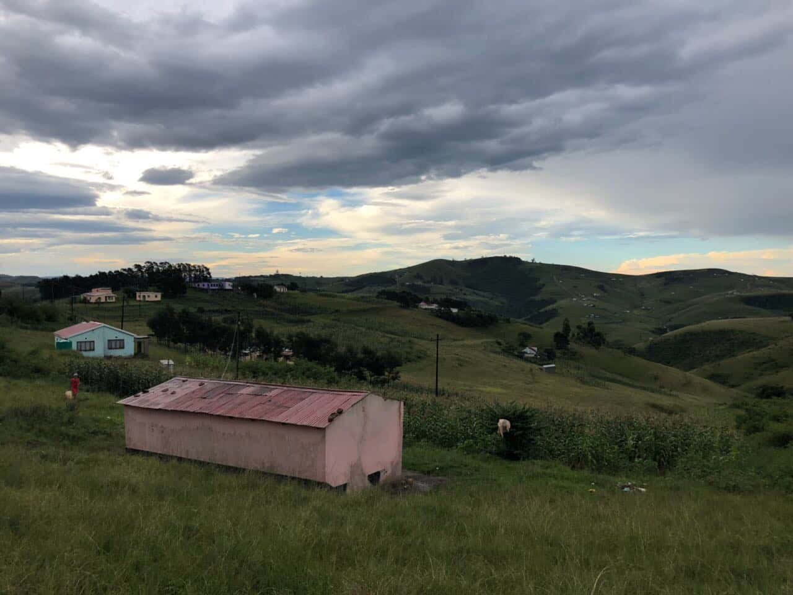
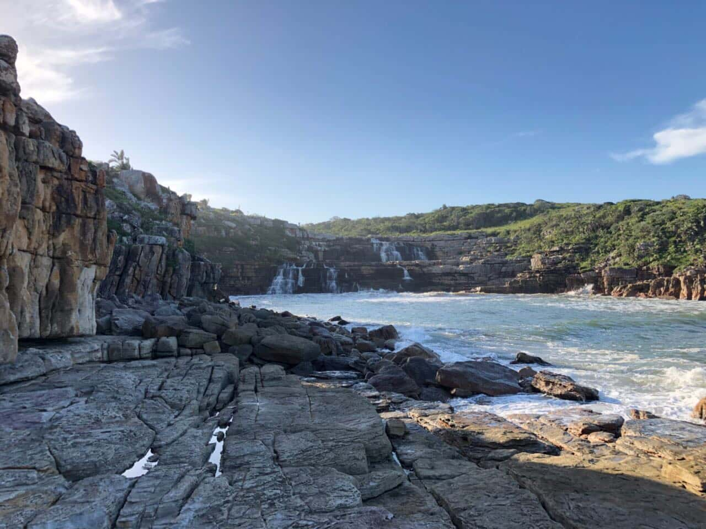
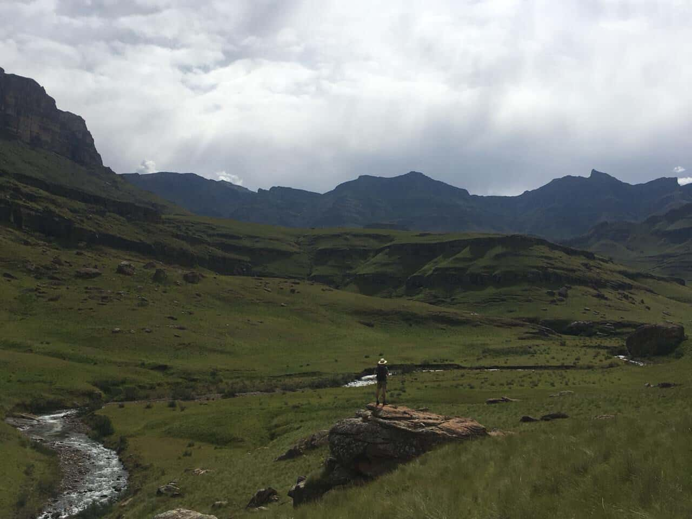
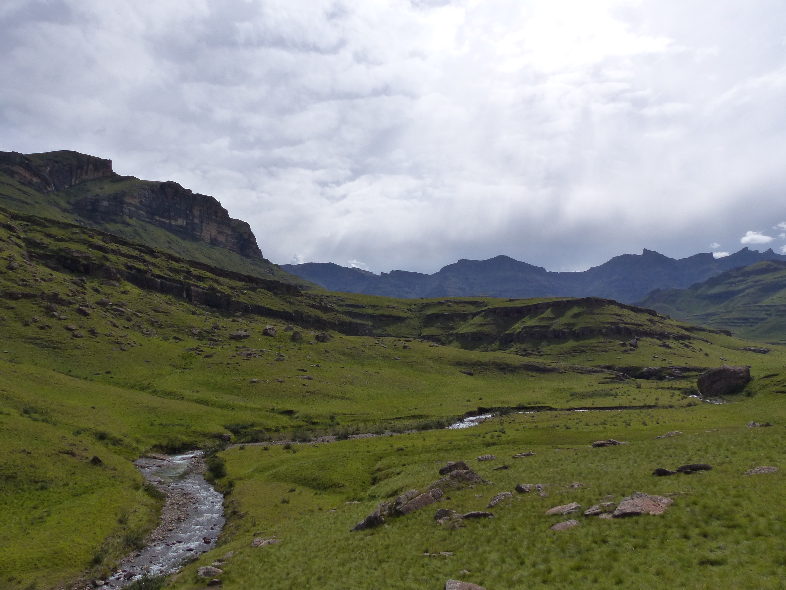
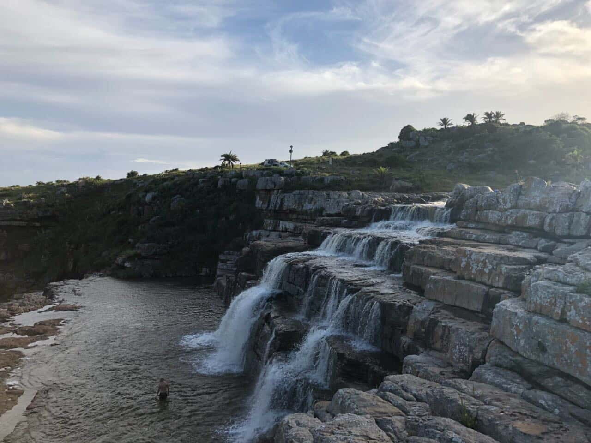
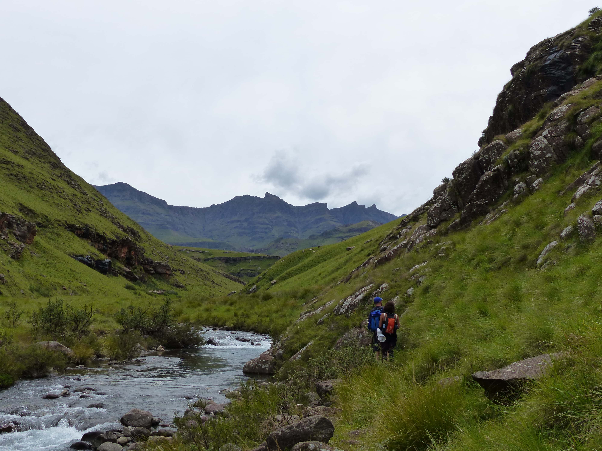
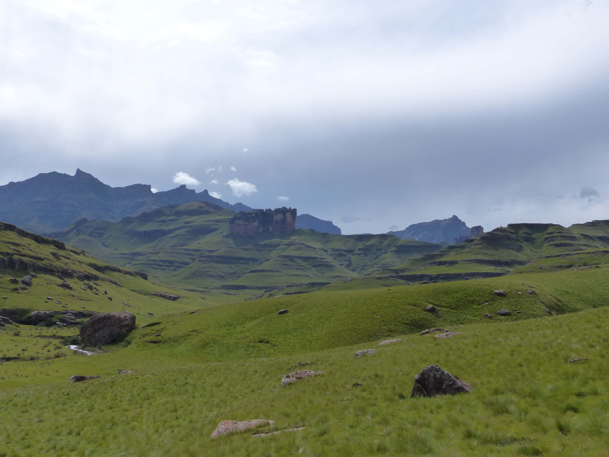
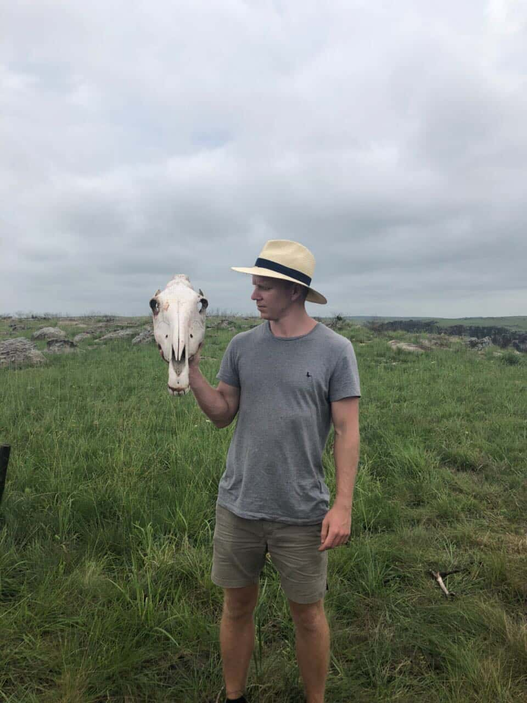

One morning last week I arrived in casualty to be met by one of the senior nurses who had a grave expression on his face: ‘Come here Dr. Ben, I’ve got to show you something.’ I was led to a bed space in a quiet corner and, on parting the curtains, saw a sixteen-year-old boy lying on the bed with a very concerned relative at his shoulder. He’d come to casualty complaining of feeling unwell with some diarrhoea and had been given treatment for gastroenteritis and observed overnight. He was about to leave that morning when his sister cried out in despair for him to reveal the real cause of his illness. With the curtains carefully drawn, the senior nurse motioned to the boy and he pulled down his trousers to reveal a grossly misshapen, infected penis almost completely denuded of skin. The traditional circumcision ceremonies had taken place at the beginning of December and I was confused as to why the boy had taken so long to seek medical attention. The senior nurse took me to one side and told me that he had been under duress from the ‘ingcibi’/traditional surgeons, who had performed his circumcision, not to tell anyone what had happened and had even threatened him with his life. 

In the last few years the government has introduced laws which necessitate ‘Ingcibi’ to have licenses though many still practice without. What was particularly concerning about this case was that the result couldn’t be attributed to a simple error; neither myself nor the nursing staff could understand why all of the skin had been removed from this boy’s penis instead of just the foreskin. Although this case was unusual, septicaemia and dehydration are common complications and in some cases where antibiotics are not effective one unthinkably terrible option remains. South Africa has the highest rate of penile amputation in the world because of septic circumcisions that do not respond to antibiotics. Amputees are ironically ostracised by the community for lack of masculinity, invariably develop substance abuse and often become suicidal. Luckily this boy’s infection cleared with a long course of intravenous antibiotics and he’s under consideration for skin grafting but I can’t imagine that he’ll have a good final result.

In Xhosa culture, the circumcision ritual marks the coming-of-age of a man; boys around the age of sixteen will suddenly disappear from their homes without any forewarning and camp out together in the mountains overseen by the ‘ingcibi’. Boys undergo circumcision and have to prove their ability to survive in the wilderness for weeks before returning home as men. The details of what happens in the wilderness are sacrosanct in Xhosa culture and no one other than Xhosa men are allowed to know. At the beginning of my time here I tried to light-heartedly probe the male nurses for more details and was met with a wall of silence. Here, one is not a man unless he has been circumcised and people are actually repulsed by those who aren’t. Initiatives have been started to encourage medical circumcision and the province has a group of highly trained nurses who travel around doing them all day; they can do one in fifteen minutes under local anaesthetic.  Every day during December, our outpatient department was filled with rows of boys in their uniform on school circumcision outings. Glancing at each group, a divide was immediately noticeable between the quieter ones anxiously awaiting their fate and the boisterous ones taunting them from the side of manhood. 

Unfortunately, there’s the perception that if you don’t have your circumcision performed the traditional way you are not a proper man so most boys are still put at risk. Controversially, a movie called ‘Inxeba’ has recently been made which reveals the secrets of the circumcision custom. Without exception, everyone in Bizana with whom I’ve spoken about the film is unanimous in their hatred for the Xhosa ‘traitor’ who revealed the secret to the Johannesburg-based film makers. The film was actually banned from most cinemas in South Africa amid the furore launched by Xhosa tribal leaders.  

The adrenaline rush of doing 24hr on-calls has begun to fade and I now look back on them with a hangover of fatigue as well as persisting disbelief. I had a particularly gruelling on-call a couple of weeks ago where frequent bleeps forced me to stave off sleep until 6am. It wasn’t until late in the night that I’d finally found a moment to escape casualty and indulge myself with ‘boerwors’ and ‘shakalaka’, my go-to-on-call dinner. However, on tucking-in, I received an exasperated call from one of the casualty sisters and had to swiftly return. Walking through casualty I could hear commotion from one of the resuscitation cubicles and entered to find a 9-year-old boy lying flat on the bed gasping for breath with reduced consciousness. His oxygen saturations were 50% which, before coming to South Africa, I hadn’t realised was compatible with life. The panicked nurse who’d called me told me that he’d fallen out of the back of an open-top truck and, on examining his chest, it was clear that a large proportion of his lungs had disintegrated from the impact of his chest wall hitting the tarmac at high speed. To make matters worse, his young flexible rib cage would have compounded the damage by providing a catastrophic rebounding aftershock. Giving him as much oxygen as possible I was still unable to raise his saturations and, as expected, intubating him provided no improvement without the availability of a ventilator at the hospital to connect to the tube. Standing helplessly with the rest of the team by the bedside, my mind whirring as I searched for options, it gradually dawned on me that there was nothing more we could do; we’d given all the treatment that was possible for a district level hospital and he’d never survive transfer to a referral hospital where he might stand a chance with mechanical lung support. It didn’t take long for him to slip away and we were all left looking at the monitor with the thousand-yard stare. After a few moments one of the nurses slowly started putting away some of the equipment and the trance was broken. As I left I passed the boy’s elderly grandfather sitting in a chair stooped over with walking stick in hand. Sitting down in the doctor’s office I resumed my battle with the long queue of people still waiting while one of the nurses told him the news. Having been trained in a setting where most people can be saved it’s difficult adjusting to a system which doesn’t allow you to provide the care you know is possible. After a few months, it’s somewhat disturbing how normalised it’s become and you just do the absolute best you can before carrying on.

Fortunately, the many beautiful places we are able to visit on the weekends give us relief from the intensity of the on-calls and the prison-like hospital compound we inhabit during the week. Photos in this entry are of recent trips to the Drakensberg mountains and Mkhambati nature reserve. Luckily, I seem to have partially adapted to the tropics and injury and malaise are no longer close companions. The potential for danger, however, never seems too far away. While in Mkhambati nature reserve we went on a hike with some Dutch and British friends to see some waterfalls and found ourselves trudging through long grass. Someone made a comment about this being prime snake territory but I, for one, didn’t give it a second thought. Although I see snake bites happen to other people on a weekly basis my mind somehow couldn’t compute a reality where this could happen to me (similar to the horse-kick). Walking in a straight line, we continued our journey through the grass admiring the views out over the ocean until at one point the guy at the front of our group suddenly shouted ‘Stop! There’s a large snake!’ Looking at the horror on his face I crooned my head forward and followed his gaze to see a large thick, half green/half beige snake coiled up with its neck erected looking over at us from a distance of 10 feet. The leader of our group - Dutch and cool as a cucumber -maintained his composure, edging his way back while, meanwhile, I had retreated in a much swifter and less graceful fashion. 

As we changed our course and made our way to rocky ground the consensus was that this snake was most likely to be a mamba. On later consulting a South African snake book I was shocked to discover that it’s unlikely to have been anything other than a black mamba, one of the most dangerous snakes in Africa. It’s said that, as a doctor, you hardly ever see a black mamba bite because it’s victims never live long enough to make it to hospital. It has neurotoxic venom which causes paralysis and death by asphyxiation. 

Our hospital sees many snake bites which almost exclusively involve rural people; often shepherds and farmer boys walking with no shoes for protection. During the time of the longest serving doctor at St Patrick’s no lethal snake bite has occurred. However, one of the Dutch doctors working at a more rural hospital than ours has seen one deadly snake bite in the year that he’s been working there. It involved a shepherd who sat under a tree to take a rest when a snake fell to the floor and immediately bit him. The snake was a Boomslang which has haemotoxic venom and, like any district hospital, they didn’t have the specific anti-venom required and referred the patient. While waiting for the ambulance the patient started having catastrophic internal and external bleeding and passed away before it arrived.

After this introduction to the world of snakes it’s safe to say my mind has reconfigured. Subsequent unavoidable walks through long grass have been accompanied by unabashed loud clapping to provide snakes with plenty of opportunity to vacate before my imminent arrival!

