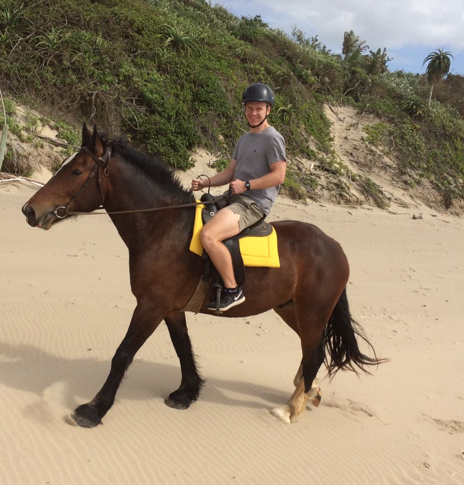

With time spent settling in, weekends away and time spent trying to learn Xhosa it’s taken me a while to get around to writing. Unlike most doctors I know who have had a baptism of fire on arrival, my introduction to working at St. Patrick’s has been really well supported. We’ve rotated around most departments during our orientation but mostly I’ve been in maternity and anaesthetics. We have to do 80 hours on-call every month which are made up of 16hr weekday on-calls and 24hr weekend on-calls. On a weekday you finish your normal working day at 4pm, work the on-call until 8am the following morning, do a half day of your normal ward job and then take your post-call at 1pm. A 24hr weekend on-call starts 8am one day and finishes 8am the next. On a quiet weekday on-call you will get quite a few hours of sleep (sometimes unbroken) but during a busy weekend on-call you may be running back and forth between casualty and maternity and the wards for most of the night. We only started doing independent on-calls after one month of shadowing which felt about right. Overnight, if a c-section needs doing I do the spinal and call in the second on-call who’s the ‘cutter’. The hospital is keen for us to learn how to perform c-sections as there aren’t enough ‘cutters’ on the roster. I’ve scrubbed in for about 10 and done three simple primagravida from start to finish but I don’t feel anywhere near ready to be doing them independently, let alone overnight when no-one’s around!

Adjusting from London to Bizana has been a slight challenge. It’s too dangerous to leave the hospital compound after dark and, even during the day, I’ve been advised by fellow doctors and locals alike not to venture into quiet areas. This is particularly difficult because the town quickly disperses into beautiful green rolling hills dotted with Xhosa settlements which I’d love to go running around and explore. Instead, my activity is confined to doing laps of a ropey athletics track a few times a week. Everyone in the town is Xhosa and I am well and truly the only ‘umlungu’/white man in the village. One evening I was overcome by a severe bout of cabin fever and decided to go running around the track even though it was a bit late and a bit dark. On entering the sports ground there was no one around except for a sketchy bunch of youths huddled at one end drinking alcohol and smoking ‘daha’. Surely enough when I approached they turned around and tried to get me to stop to which I duly sped off at record pace. Propelled by my cabin fever I decided, instead, to run around the busier roads of the town which I’ve been advised are always safe. Needless to say, an alien lifeform descended from Mars would have received less attention than I did. With each successive heckle of ‘ummmlluuuunnngguuuu’ bellowing after me down the street I felt more and more like a ‘Clapham tragedy’ abroad – wearing my navy shorts and ‘sloganed’ T-shirt, popping out for a bit of exercise before coming back to a wholesome flexitarian meal - while most people in Bizana don’t even have jobs and live off government grants of £15/month. 

Just one on-call spent in casualty enlightens you to the darker sides of Bizana and shows you what a different beast medicine is in this part of the world. Substitute the UK nursing home resident with a UTI for a stab victim. Pneumonia/COPD for TB. Everyone has HIV. Some things, however, still remain the same: diabetes, high blood pressure, (though oddly we see no ischaemic heart disease), headaches, gastroenteritis. One afternoon a few weeks ago I was in casualty and 25 people came in after a head-on collision between two minibuses. Luckily it was relatively low-velocity with no casualties but one guy had a serious head injury with low GCS and a blown pupil and many others had open long bone fractures. If that happened in the UK it would be red alert with consultants coming in from home to have all-hands-on-deck but here it’s so normalised - it was just myself and a couple of others wading our way through having a quick ‘eyeball’ of each patient as they entered the department as a rudimentary form of triage. 

Everyone told me about the violence in South Africa but I didn’t understand it until working here. Every day casualty sees an endless stream of men who have been stabbed or beaten, often under the influence of alcohol. We also see lots of domestic abuse of women and children who we refer to a social worker though I’m not entirely sure how much difference they can make. It’s not just the volume of trauma, though, it’s the type of trauma that comes in. Many people get beaten so badly that they get a level of muscle breakdown normally seen in the context of crush injuries. One man arrived in casualty dead on arrival having been axed in the head with his brain fanning out of his skull. Apparently, the previous year he’d killed the brother of the man that ended up killing him. My first gunshot victim was a lady who got attacked with her husband while they were at home on their farm. She escaped with three gunshot wounds to the thigh but he didn’t make it. People in Bizana seem to get killed for their phone, wallet or over any disagreement no matter how big or small. 

Unlike our introduction to work which has been relatively safe and controlled, our weekend trips have caused us no end of malaise and injury. Things were going swimmingly until our third weekend when we went horse riding (not my idea) at a farm on the coast and I was presented with this absolute stallion of a horse called ‘Pi’ who I had a bad feeling about from the start. I don’t know where I first lost his respect? Was it the few attempts it took me to get my foot into the stirrup (because it was so far above shoulder height)? Or the clench of my buttocks which betrayed my attempts to appear confident and at ease? Whatever it was, from the word go he’d decided we weren’t going to be friends. Having been horse riding once before I thought I had a vague idea of what to do but he didn’t seem to respond to my cues; when he felt like galloping he would gallop but when I jabbed him in the ribs or shimmied the reigns to get him going he just remained still. Any attempt to soften him through stroking or talking softly were met with dismissive flicks of the mane and looks towards the opposite direction. In spite of our early disharmony the setting was beautiful – we rode down from a farm on the hill through fields of lush tropical vegetation and small winding lanes until we reached a deserted white sand beach. Riding down the beach was spectacular and, when Pi felt like it, the galloping was great. Unfortunately, it turned out my doctor companion had her own set of equine trouble and after one group gallop I turned back to see she’d fallen off and was lying flat on her back with the waves lapping around her motionless body. Thinking the worst I panicked, dismounted and went over to find that, luckily, she was okay and only shaken and bruised. She later revealed that she may have self-ejected herself from the horse while it was mid-gallop but she can’t really remember and the whole thing’s a blur. Walking back over to Pi to continue our ride I thought about what a great story our horse riding adventure would make and gently stroked his mane before raising my left foot to lofty heights in an attempt to mount him. Then, like something out of a horror movie he turned his head around, looked me dead in the eye (directly acknowledging my existence for the first time) and gave a sweeping side-kick with his rear left leg sinking his hoof into the meaty sweet spot of my right thigh. Initially it was just the mother of all dead legs and I found the whole situation incredibly funny - hopping around alternating between cries of pain and hysterical laughter the others must have thought I’d been kicked in the head. Unfortunately, later that day and the next morning a nice tight haematoma formed which put me on crutches for one week and has left me limping since. He got me. He got me good. 

The following weekend we went to the ‘activity’ hub that is Mkambati nature reserve (I couldn’t do much) and Fatima jumped off ‘suicide rock’ wearing a life jacket and jarred her back so badly when she hit the water that she subsequently had to develop a 25 minute, multi-stage routine for getting out of bed in the morning which she’s only just beginning to taper down. The following weekend was the Christmas break which we spent at the widely known Mdumbi backpackers which had a great festive spirit and is run by a lovely bunch of people. Of note, on Christmas day I got sunburnt for the 4th time since arriving in South Africa but for the first time in my life at Christmas which was cool. As we set off after a great few days Fatima remarked how this was the first trip in some time where neither of us had come to harm and, at that point, I decided not to tell her about the extremely tender 5cm lymph node in my left groin hoping it would just pass. However, throughout the drive I developed quite a bad headache and started to sweat and felt it was unlikely (though not impossible) to be the two and a half beers I’d had the night before. I decided to tell her and somewhere in the process of us brainstorming the differentials of a ‘swollen inguinal lymph node in the tropics’ I remembered that there’d been something painful on my left foot when I put my sock on that morning (which at the time I’d assumed was sunburn). I removed my sock and found an eschar. African Tick Bite Fever. Great. It’s common here and luckily after a few days of headache and fever tablet antibiotics will sort it out.

So it was with a limp and the remnants of African Tick Bite Fever that I started my mammoth New Year weekend on-call. I was second-on call for the Friday and was praying there would be no c-sections after 4pm so that I’d be able to sleep instead of do spinals and be well rested to start my 24hr first on-call from 8am. Unfortunately, my prayers were not answered and there were four, two of which came in the middle of the night. As with a normal Saturday on-call I worked through from 8am until 3am the following morning with 2 x 45 min breaks. I saw about 65 patients in total in casualty: the pace is much quicker than in the UK because you have such fewer options: only emergency bloods/no imaging/no internal referrals/no seniors with which to discuss. They either need admission if they can be managed locally, referral to the regional hospital three hours away if they’re really sick/complicated/a clear cut case for surgery and if you’re not sure you just observe and see which way they go! After nearly two months I’m becoming a bit more versed with managing common casualty cases: stab wounds, road accidents, head injury, reduction and splinting of broken bones, miscarriage, children with common things like gastroenteritis/viral infections/snake bites/paraffin ingestion as well as medical emergencies commonly seen in the UK. A bit more out of the ordinary this on-call were the seven lightening victims who arrived after a huge storm. They all looked exactly like they’d just been struck by lightning with a range of bewildered expressions and dishevelled appearances. One completely refused to speak and just looked straight ahead, wide-eyed. Amazingly, the most severe complaint was mild back/muscle ache! I took the ‘school nurse’ approach and gave them paracetamol which felt ridiculous but I felt obliged to give them something after surviving an act of God! Tragically, one 8 year-old child was dead on arrival who I think must have had a direct strike while the others must have only been glanced. Apparently, people attribute getting struck by lightning to witchcraft and I wondered whether a gaggle of assaulted witches would turn up in casualty but they never came.

Maternity was also very busy and I had to refer a really sad case of a woman who came in with reduced foetal movements and turned out to have an intra-uterine death caused by a placental abruption. Maternity was the specialty I was most concerned about on starting here as there’s so much of it and the stakes are so high! Thanks to the help of the radiant Congolese maternity doctor I’ve actually become reasonably confident with clinical examination, obstetric/pelvic ultrasound, evacuation of miscarriage and have some idea of how to deal with most common problems. What I’m still not confident with is working out which patients in labour need to go for c-section and depend on the midwives a lot! In the early hours of Sunday morning I was called about a primagravida with poor progress and high foetal head who therefore needed a c-section (according to the midwives). Unfortunately, her Hb came back as 5.2g/dl (not entirely sure why) so we couldn’t do the c-section locally. I called a particularly unfriendly specialty doctor at Mthatha referral hospital and my shaky knowledge must have shown because I got crucified before being hung-up on, much to the amusement of the midwives sitting around me. After a few long minutes of continuous midwife laughter I decided it was time to get the big guns out so I called the specialist again and deployed my nuclear option – ‘profusely-apologetic-extreme-politeness’. She was duly forced into submission and accepted the patient.

It’s been a great couple of months and I’m feeling settled at the hospital and really enjoying the work which is so much more interesting and satisfying than being a junior doctor in the UK that it’s ridiculous. I feel really fortunate that I’m having the opportunity to be trained by specialists in paeds, maternity and anaesthetics as most foreign doctors working at rural hospitals won’t be so lucky. I’ve learnt and seen loads but there’s a lot to improve on if I’m going to achieve the goal of becoming the well-rounded rural African doctor who’s capable of doing everything. That’s probably an ambitious aim for one year anyway but here’s to trying! There’s a lot more that I could write about but I think I’ll leave it here for the time-being. Happy 2018 to anyone reading!