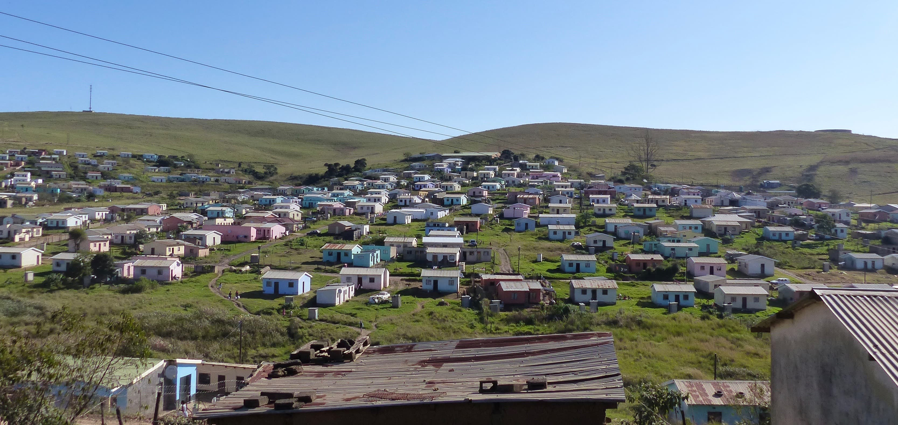

Due to work and weekends away I missed the opportunity to play in any of the remaining league matches which saw ‘The Killer Stars’ make a late surge up the table, putting them in second position with just a couple of games to play. Regrettably, bad results at the business-end of the season saw them ending in third position which remains a source of bitter disappointment even after the passage of a significant amount of time. 

A conspiracy theory is cited as the root cause of their defeat: the league officials apparently arranged the kick-offs for their crucial final matches to be at times when their key players were unable to play. Like most conspiracy theories, I imagine it would be very difficult to ever verify its credibility. I recounted the theory to one of the doctors who grew up locally, however, and he said he’d be surprised if the Bizana League wasn’t riddled with deep-seated corruption. When this doctor was eighteen years-old, his school took advantage of the fact that he looked young for his age as well as being a good footballer and issued him with a pass containing a date of birth which made him eligible for the under-thirteen team. The under-thirteens had a good season that year and he’s still very proud of it. 

On my first available weekend ‘The Killer Stars’ didn’t have a game and, instead, ‘Coutinho’ was invited to make his Bizana debut in a friendly game for their sister-team - ‘The Peacemakers’. The match took place in ‘Umlacu’ which, like most rural villages around Bizana, doesn’t have a sewage system, running water or power but does have quite a large football pitch, albeit with a generous right to left slope. As no ‘umlungu’ has ever played in a Bizana football match within living memory I was something of a novelty when I stepped out of the car. On arriving it wasn't yet clear who our opponents would be and I wandered around the pitch taking photos of the game before ours while the discussion was taking place. Looking upon the swathes of local men heckling the players for the slightest mistake I tried not to think about how many of them would stay on to watch our game. 

After some time, it was excitedly announced by our manager - ‘Mlu’ - that we would be playing our friendly against ‘The Spears’ who are a professional football team playing in the highest Eastern Cape division. As my greatest football accolade to date was playing centre-back for the Alleyn’s School 2nd XI in 2008 I was slightly anxious when they positioned me as a striker against a tough opposition in front of the vociferous local crowd. In spite of never having seen me play before everyone seemed to be in firm agreement that I was going to bring them good fortune. I was also given the honour of delivering the blessing in the pre-game huddle. Meanwhile, below the surface I prayed that I may at least have an athletic edge over the defenders in a land where the people are of more humble stature. Seconds after the game started I instead found myself face-to-chest with prime specimens of the Xhosa race. 

I don’t think the boys would mind me saying that we struggled in most areas of the pitch. Due to an incredible amount of hard-work on a hot Sunday afternoon we managed to cling on to a ‘0-1’ score line at halftime. However, somewhat inevitably, the second half saw the floodgates open and we ended up losing ‘0-5’ with yours truly offering very little in the eerily peaceful half of the pitch. Thankfully, the heckling I received (or at least heard) was limited to one corner of the pitch repeatedly asking:'How old are you?' Make of that what you will. In spite of the underwhelming performance I was met with many warm smiles and handshakes after the game with people saying it paid testament to the ‘The Rainbow Nation’. Earlier when I’d asked a team mate if it was safe to walk around with my camera he said: “Of course, these people will protect you!” The Bizana paradox is that in this situation I felt safer than I do in London walking around with a camera while, in another situation, walking around with a camera would put me in serious danger.

Like people all across South Africa, the people of Bizana were greatly moved by the passing of Winnie Madikizela-Mandela last month. Although a controversial character, her supportive role to Mr. Mandela as well as the work she did independent of him was instrumental to the fall of apartheid. She’s seen by all black South Africans as the ‘Mother of the Nation’ and a week of mourning was declared. Being her home town, a memorial service was held in Bizana and, for lack of a better option, the ropey athletics arena across the road from the hospital was chosen. All top government officials attended, including Cyril Ramaphosa. For the preceeding twenty-four hours our dusty, breeze-block town was swarmed with four by fours with blacked out windows and smart city people dressed in high-end suits. As many as ten-thousand people were expected to attend and we had to make special contingency plans in the case of a major incident. Rumours were circulated that top government officials would take the opportunity to pay a visit to St. Patrick’s after the service and everyone turned up to work looking particularly smart that day. 

Working in casualty, I fancied that my chances of meeting the President were reasonably high and got up early to have a close shave and buff my stethoscope. The sound of chanting could be heard from school groups outside and, from a particular first floor window, crowds of people and news vans with satellite dishes could be seen surrounding a huge gazebo in the middle of the sports arena. At 2 o' clock my energetic excitement was just starting to wane and I was about to break for lunch when we received intel that a visit from the health minister was imminent. I stayed on, the bounce in my step magically restored. I was not the only one who kept on working until well after hours in the hope that he would eventually appear. After some time, there were no more patients waiting to be seen, the crowds had dissipated and we slowly came to the realisation that he must have gone on his way. It crossed my mind that the hoax visit could have been a highly effective management ploy but I’m sure this wasn’t the case. 

My time in casualty has come to an end as I’ve been rotated to ‘male ward’. Some things I will miss but generally I’m happy to move on. As well as seeing many life-threatening problems over the last few months I’ve also seen my share of less acute issues: a few weeks ago, I was pulled out of the consultation room to see an elderly woman lying on a bed who, the nurse told me, had come in with ‘bad news’. I assumed there’d been some miscommunication but on checking her over all I could see was that she had a moderately high blood pressure (appropriate to her level of stress) and was sad. In spite of this, the nursing staff had inserted a very large intravenous line capable of resuscitating someone with catastrophic bleeding and fluids were running STAT. Furthermore, her blood pressure had been medicated and meticulously re-checked every 30 minutes since arriving. I leant over to the nurse beside me and remarked on how bizarre this was to which she gave me a disdainful look before going back to re-check the patient’s blood pressure again. After some hesitation, I filled out a social worker referral form and prescribed some more intravenous fluids to appear less heartless. I’ve since seen many similar cases and have arrived no closer to understanding what’s expected of me.

Non-football photos: Patrick - the 'Umlacu' cameraman - with the lads, 'Highlands' location of Bizana town, Maboneng sunset in Joberg, Vilankulos sunrise in Mozambique.