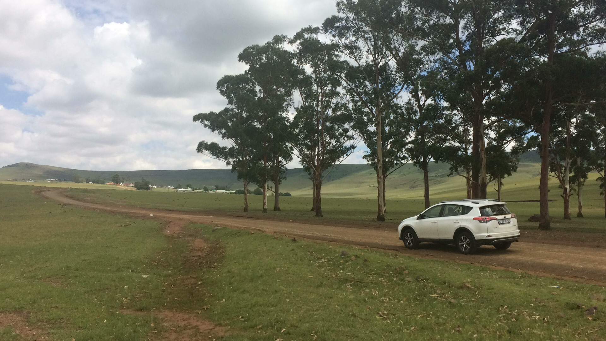
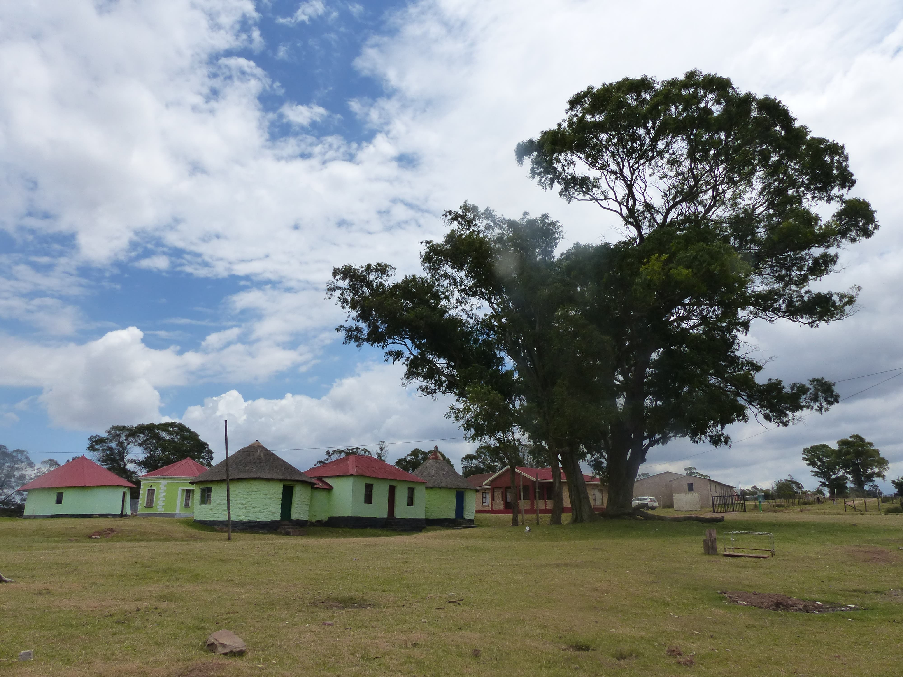
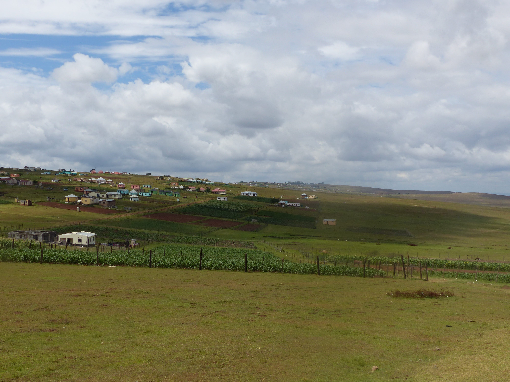
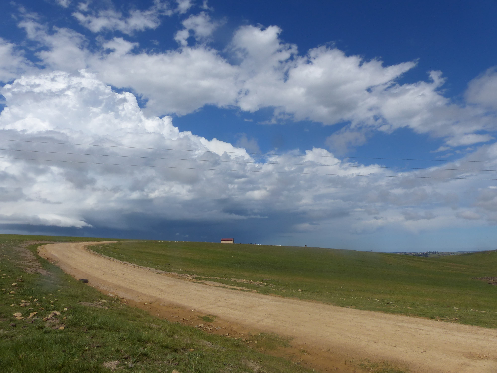
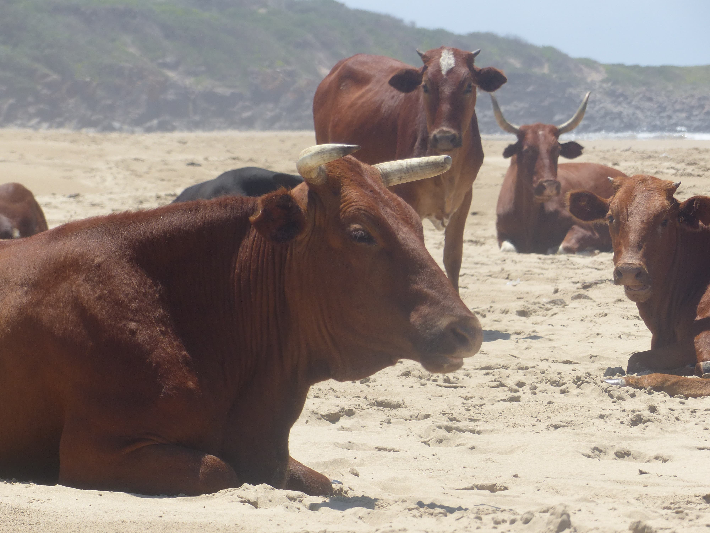
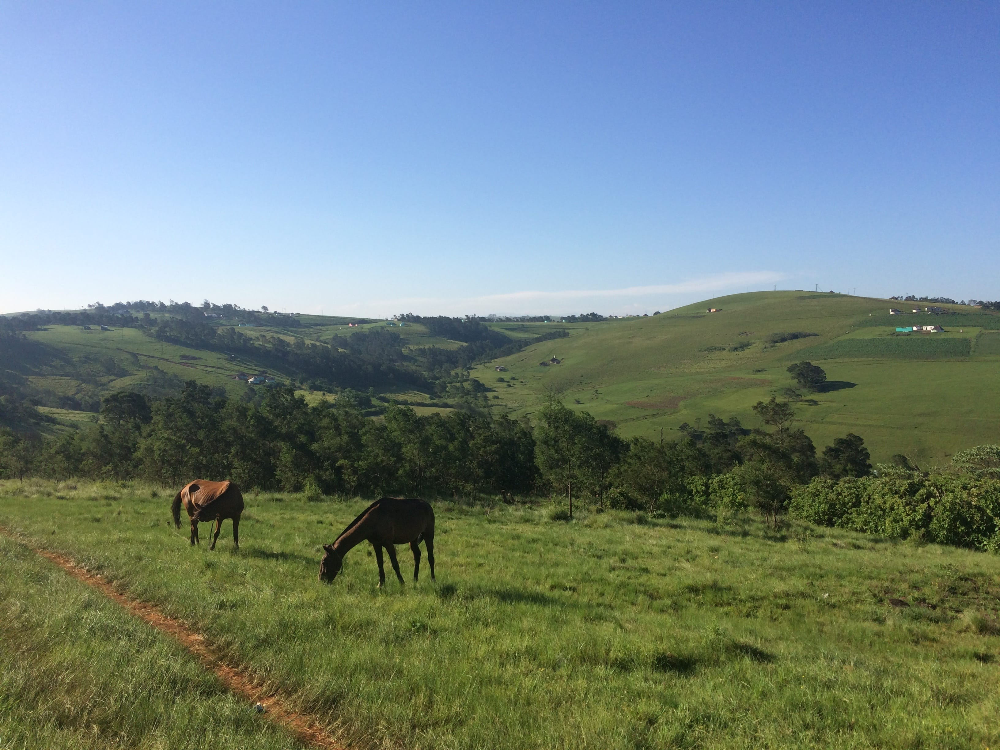
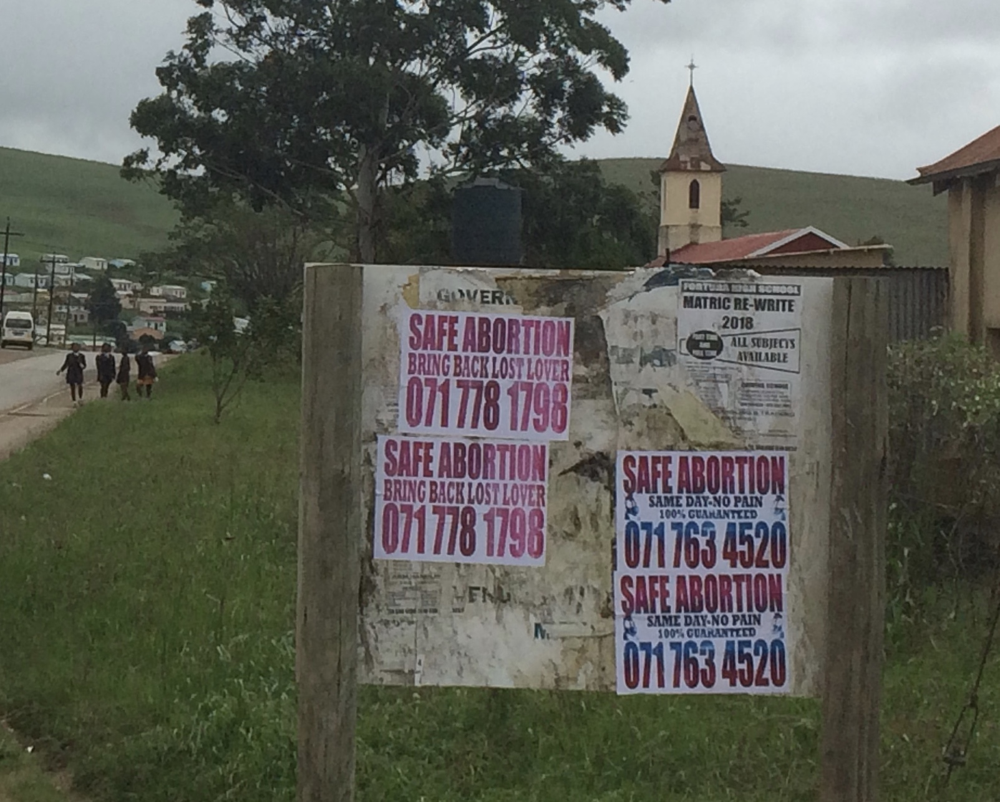
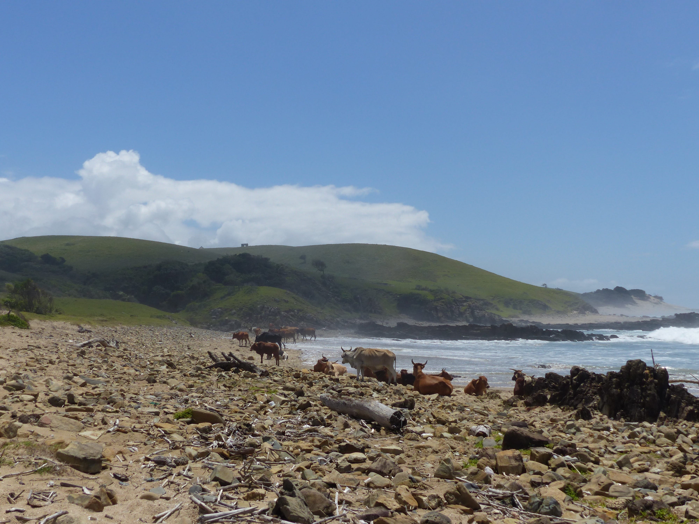

I went on holiday a few weeks ago and was driving through Qunu, the birth place of Nelson Mandela, where I was hoping to visit his museum which I’d heard great things about. ‘Long Walk to Freedom’ is the clichéd book of choice for my South African gap year just as ‘The Motorcycle Diaries’ was for the gap year of my late teens. It turns out the years of experience in between haven’t rendered me any less impressionable. As Mandela was Xhosa and grew up only a few hours south of Bizana a lot of his childhood stories resonate with the customs and traditions I’ve learned of in my time here. The mysterious ‘coming-of-age’ circumcision ritual about which no woman knows any details and no boy or man will ever discuss, is described, although sparingly. I’ve just read the part where he meets Winnie Madikizela, a local Bizana gal who becomes his second wife. The name ‘Madikizela’, although sounding exotic, is actually the Bizana equivalent of ‘Smith’. Apparently, there’s one rural village where every single person is a Madikizela because of one index stud who sired a prodigious number of sons. At the gate of the Nelson Mandela museum a sign read ‘Closed for Renovation until 2019’ and a security guard swiftly sent me on my way. Instead, I decided to try and find the village, Mqhekezweni, where he was taken in and educated by the amaThembu royal family to return a favour paid by his father to the family many years before. The Xhosa people are made up of a number of tribes which have quite well prescribed geographical locations. The amaThembu populate the surroundings of Mthatha, the amaGcaleka live by a section of the coast and the amaPondo are my local people. The Eastern Cape is no stranger to the classic North/South snobbery: the most Southern tribe (who’s name I’ve forgotten) look down on the amaThembu further North who in turn look down on the amaPondo straddling the Northern border.

I’d been following what I thought was the dirt road to Mqhekezweni for some time but there were no signs, the road was rough and I started to doubt myself. I stopped to ask someone if I was going the right way but unfortunately, because Mqhekezweni contains a ‘q’ I couldn’t get close to articulating a word that vaguely resembled the name. Repeatedly pointing at Nelson Mandela’s face on the front of the book also did surprisingly little to help me. I continued driving on through a number of small villages until signs started appearing for ‘The Great Place’. Based on the way Mandela described Mqhekezweni (although admittedly from his 6-year old perspective) and because it’s royal I was slightly disappointed when I arrived at the final ‘The Great Place’ sign to see a collection of rather rundown looking rondavels with no one around. 

As I wandered through, an elderly lady came out to greet me who revealed herself as the mother of the current amaThembu King. She only met Mandela later in life, after he was released from Robben Island, but had got to know him well and recounted many affectionate stories about him while she guided me from one rondavel to the next. The tour culminated with the highlight: a small rondavel with bare walls and spartan furnishing except for a wooden framed single bed in which he'd slept throughout his teenage years. She went on to tell me how her firstborn lives something of the high life in the big city (Mthatha) but frequently comes back to adjudicate the tribal court. Commonly encountered issues that he has to resolve are land infringement, stolen livestock and cases of assault. I didn’t arrive at an understanding of what actions the King has the power to take and which things have to be decided by the municipality. A line must exist though because she did tell me the story of a King from another tribe who recently had a rush of blood to the head and went medieval: killing a bunch of people and burning down some houses and it wasn’t okay and now he’s in prison.

After the tour was finished I sat under a tree and started eating my lunch only to glance over and see a rather down-and-out looking guy sidling over wearing a hat marked with the slogan ‘I love weed’. I was under no false pretence that this was a man who wanted something from me and was therefore taken aback when he revealed that he was the younger brother of the current King and third in line to the amaThembu throne. As his monologue continued I couldn’t help but notice a demeanour similar to that of the younger Prince Harry: a rebellious anti-establishment deameanour borne out of being a man of royal blood but relatively neglected by the limelight and with minimal risk of ever having the ‘big responsibility’. The reality was actually much worse: the days of special privilege for all members of the royal family are long gone and, although he’d gained a degree he’d been unable to get a job just like countless other people from the Eastern Cape. He’d therefore remained unemployed living with his mum at ‘The Great Place’ while his older brother lives it large and, understandably, he’s developed some bad habits. To make things worse, the Nelson Mandela museum periodically arranges lavish events in Mqhekezweni for European tourists paying through the nose with marquees, buffets and VIP portaloos to boot. The family’s allowed to attend and help themselves to as many cocktail sausages as their hearts could possibly desire but then the entourage leaves with a huge profit and doesn’t let them see any of it. His piece left me so enraged at the injustice of it all that when he finally got around to asking me for money to buy some cigarettes I gave him enough to keep up the habit for a good while longer.
	
    
    
After the supervised induction period it’s been quite a shock to move to casualty and be the most senior doctor there. The workload is mainly trauma from road accidents, assault, animal associated injuries and people just generally doing ridiculous things. At the time of my horse-kick I was surprised (and slightly disappointed) that my tale didn’t receive the same incredulous reactions from my South African colleagues as it did from my friends in London. It turns out ‘horse-kicks’ are a very regular occurrence around Bizana and, in the grand scheme of things, mine was very minor. It also turns out that the damage inflicted by horses can be lightweight compared with other animals: the other day I picked up a patient’s file to see the note ‘galled by oxen’ written in the nursing notes. On peeling away the blood-drenched homemade bandage from the inside of this elderly lady’s thigh I was confronted with a gaping circular wound about 15cm wide and was shocked when my sterile probe almost disappeared to 20cm in depth. A cow is never too far away when living in the Eastern Cape and, regrettably, I’m no longer able to feel at ease in their presence.

Casualty has the dual role of working as an emergency department and a clinic for following up fractured bones which ordains me with the dual role of being an A&E and orthopaedic specialist. South Africa’s private healthcare system is world class and hugely disparate from the public system (which serves 80% of the population) and working with orthopaedic patients has been the harshest display of this for me so far. One public orthopaedic hospital serves the seven million accident-prone people living in the Eastern Cape and it doesn’t nearly have the capacity to provide acceptable management to everyone. Many fractures which unequivocally need surgery have to be managed with just a cast with often devastating consequences on patients’ quality of life thereafter. I reviewed one twenty-year old guy with learning disabilities who came for review six weeks after being in a road accident which left him with an unstable ankle fracture. Surgery was the only reasonable option but at the time he came in there wasn’t capacity at the orthopaedic hospital so he was put in a cast with crutches and told not to weight bear while our doctors repeatedly and unsuccessfully tried to obtain him a bed. He hadn’t understood the instructions and had been using the crutches wrong, putting weight on his ankle and his repeat x-ray showed terrible deformity a lot worse than when he’d first come in. A huge amount of time is spent repeatedly calling the orthopaedic hospital to get beds for a long list of patients like him but we’re unsuccessful with a large number of them. To add to the frustration, often once we have been successful in obtaining dates for surgery there’s no patient transport available on the day, patients miss their operation and the whole process has to be started again from scratch.

Second to trauma the next biggest contribution to our workload are women coming in with miscarriages. At first I thought this was explainable just by the large number of children that women have but over time it became clear that many are younger girls coming in with signs of unnatural miscarriage. Walking around Bizana, one of the first things that strikes you is the many garish pink signs advertising ‘Safe Abortion’ that are plastered on lampposts, signs and bins at every street corner. Young girls aren’t educated about contraception, fall pregnant and medical termination of pregnancy isn’t a service that is available probably due to a combination of local religious beliefs and a lack of resources. They therefore have to pay for back-alley abortions which do a half-job but put them in a legitimate position to seek medical help with signs of a ‘miscarriage’. Casualty is so busy during the day that often the evacuations are performed by the doctor on-call. When performing an evacuation in the early hours of the morning once I’ve finally cleared the queue in casualty and I’ve been working for 18 hours straight it’s hard not to feel a bit frustrated by the situation!

Luckily for me, in the dicier moments in casualty there’s often someone more experienced to help out. The other day a nurse came over to tell me someone had dropped a ‘grinder’ on their foot. I imagined a ‘grinder’ was some sort of device used at a butchers but to my horror I was informed that it’s the South African word for chainsaw. There was a deep gash on the inside of his foot and I could see the artery pulsating with very rapid blood loss. Pressure only temporarily stemmed the bleeding and I played through the horrific scenario in my head of trying to transfer him to the referral hospital three hours drive away. I went over to maternity to seek the help of the Cuban obstetrician who calmly walked over to casualty, picked up a pair of forceps and stuck them into the wound clamping the artery in one go. She then proceeded to tie it off with a knot that I don’t even know the name of before calmly heading back to maternity. As ever, you have to manage many crazy situations alone here but it’s great that, for some things, there are experienced people around to help!

