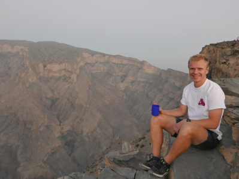
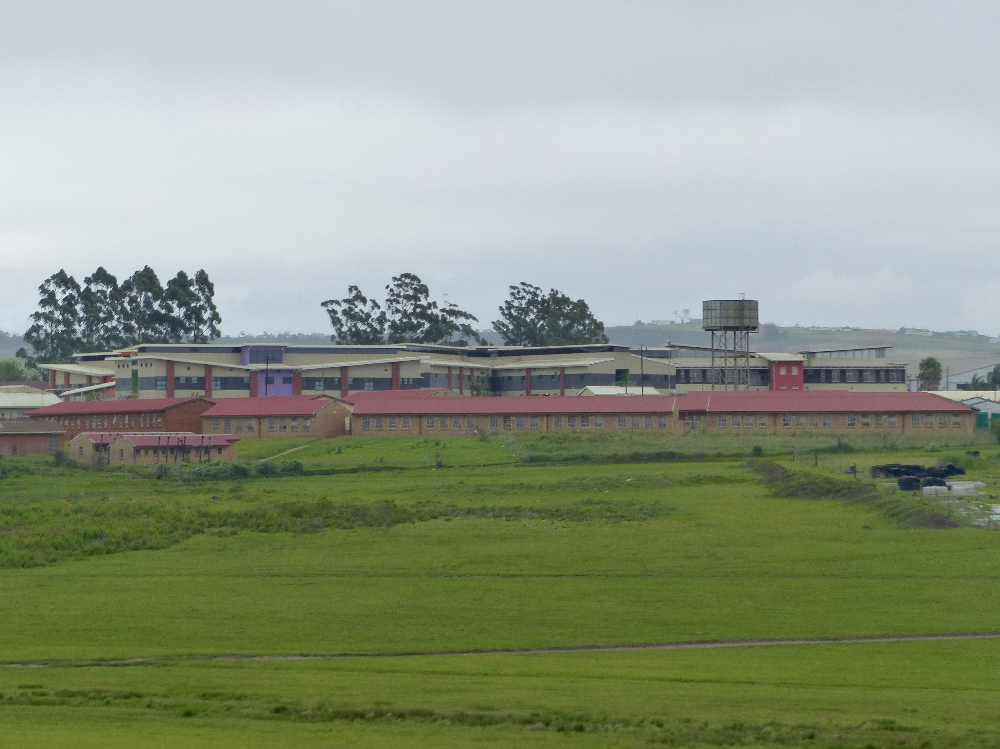

##Me
F3 doctor with a love for travelling and an ability to look slightly out of place wherever I go. I got my job in South Africa through [Africa Health Placements (AHP).](http://ahp.org.za/)

##Bizana
A small dusty town in the northern part of the Eastern Cape and former Transkei. It has all the essentials (bank, shoprite) but little to fall in love with. Winnie Mandela and OR Tambo, an apartheid activist, grew up here. Like most of the Eastern Cape the rate of unemployment is very high and most people live off government grants. Alcohol abuse and violence are rife. Being three hours south of Durban and the Drakensberg and one hour from the Wild Coast makes the location great for weekend travelling.

##St. Patrick’s Hospital
A busy 270 bed district general hospital with casualty, OPD, maternity, paeds, general male/female wards and theatres (c-sections only). The hospital was recently redeveloped and has gynaecology, surgical and a TB ward ready for use but the hospital hasn’t yet been able to recruit enough doctors and nurses to be able to start running them. The hospital has its own laboratory for routine tests and is able to send off other samples to the referral hospital in Mthatha. X-ray and ultrasound machines (but no ultrasonographer) are also available. The number of doctors will fluctuate but currently we are ten – seven medical officers working as generalists and three specialists in anaesthetics, maternity and paediatrics. Specialist input means that high quality training is given which is unusual given the rural location.

